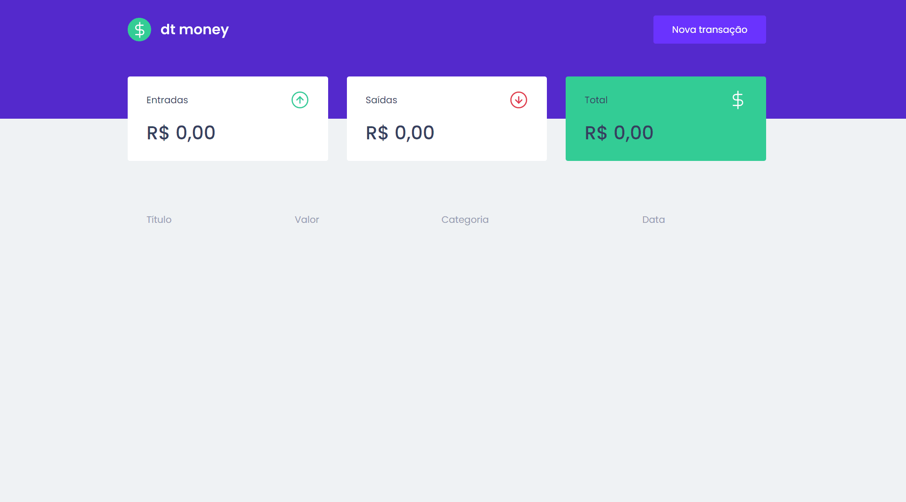

<h1 align="center">
  
</h1>

  
  width="100%">

 

## 🚀 Technologies, Hooks and Libraries

- ReactJS
- TypeScript
- useState 
- useEfect 
- Context API 
- Styled Components 
- Mirage JS 
- Axios 
- React Modal 
- Polished 

## 💻 Project

dtmoney is a financial control application and it was developed during Chapter II classes of the Rocketseat Bootcamp Ignite ReactJS track, and it is possible to register and delete transactions and see the entry and exit balance.

## 🔖 Layout

You can view the layout of the project via [this link](https://www.figma.com/file/0xmu9mj2TJYoIOubBFWsk5/dtmoney-Ignite-(Copy)?node-id=0%3A1). 

---

Made by Breno.